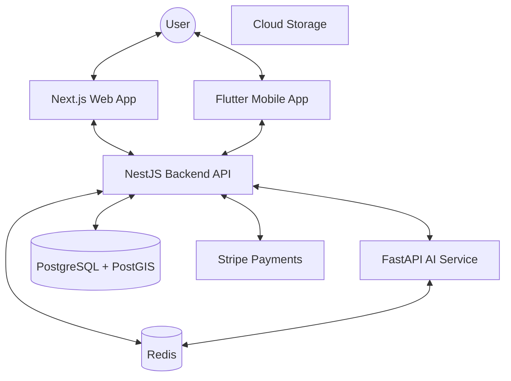

# Smart Job Platform - Architecture Documentation

## High-Level Architecture

The Smart Job Platform is built using a **Microservices-inspired Monorepo Architecture**. Each component is designed with **Clean Architecture** principles to maintain a strict separation of concerns.

### System Diagram

## Backend Architecture (NestJS)

The backend follows a modular approach where each domain is encapsulated in its own module.

### Core Modules

- **Auth**: JWT-based authentication with Refresh Tokens and Role-Based Access Control (RBAC).
- **Users**: Profile management for Job Seekers and Employers.
- **Jobs**: Job lifecycle management with geospatial indexing for location-based search.
- **Applications**: Handles the hiring pipeline, from submission to hire/reject.
- **Matching**: Orchestrates calls to the AI Service for candidate ranking.
- **Payments**: Integration with Stripe for employer subscriptions and featured jobs.
- **Audit**: Tracks all critical system actions for security and compliance.
- **Analytics**: Aggregates data for dashboards.

### Patterns & Practices

- **Dependency Injection**: Heavy use of NestJS DI for decoupled components.
- **Interceptors**: Global response transformation and logging.
- **Filters**: Unified error handling across all endpoints.
- **Guards**: Role-based and ownership-based authorization.
- **Decorators**: Custom decorators for user extraction and caching.

## Frontend Architecture (Next.js)

Built using Next.js 14 with the App Router, focusing on performance and accessibility.

- **Routing**: Locale-based routing (`/[locale]/...`) for i18n.
- **State Management**:
  - **Zustand**: For lightweight global state (e.g., UI preferences).
  - **React Query**: For server-state synchronization and caching.
  - **React Context**: For localized state (e.g., multi-step forms).
- **Styling**: Tailwind CSS for responsive and RTL-compatible design.
- **Components**: Atomic design approach with a focus on reusability.

## Mobile Architecture (Flutter)

The mobile app implements **Clean Architecture** with three main layers:

1.  **Presentation Layer**: Widgets and Riverpod Providers.
2.  **Domain Layer**: Entities, Repositories (Interfaces), and Use Cases.
3.  **Data Layer**: Repository Implementations, Data Sources (Remote/Local), and Models.

### Key Features

- **Responsive UI**: Adaptive layouts for different screen sizes.
- **Offline Support**: Local caching of job listings and profiles.
- **Bilingual**: Seamless RTL/LTR switching.

## AI Service (Python FastAPI)

A specialized service for heavy ML tasks, utilizing sentence-transformers for semantic understanding.

- **Semantic Matching**: Converts resumes and job descriptions into high-dimensional embeddings.
- **Resume Parsing**: Extracts structured data (skills, experience, education) from PDF/DOCX.
- **Skill Gap Analysis**: Compares candidate skills against job requirements to identify missing areas.
- **Screening Engine**: Generates context-aware interview questions and evaluates candidate answers.

## Data Flow

### 1. Job Search Flow

1. User enters keywords and location on the Frontend.
2. Frontend sends request to `GET /api/v1/jobs` with coordinates.
3. Backend performs a PostGIS query to find jobs within the specified radius.
4. Results are enriched with matching scores if the user is logged in as a Job Seeker.
5. Paginated results are returned to the user.

### 2. Application Flow

1. Job Seeker applies to a job.
2. Backend triggers the AI Service to parse the resume (if not already parsed).
3. Backend stores the application and notifies the Employer via WebSockets.
4. Employer views the application, seeing an AI-generated match score and summary.

## Security

- **Authentication**: JWT with `access_token` and `refresh_token`.
- **Authorization**: RBAC (Admin, Employer, Job Seeker).
- **Data Protection**:
  - Input validation using Zod schemas.
  - Sanitization of all user-generated content.
  - Rate limiting on sensitive endpoints.
  - Security headers via Helmet.
- **Blind Hiring**: Optional mode that hides candidate names, photos, and gender to reduce bias.

## Scalability & Performance

- **Caching**: Redis caches hot data like job categories, popular searches, and user sessions.
- **Database**: Indexed frequently queried columns and used PostGIS GIST indexes for locations.
- **Statelessness**: The API is fully stateless, allowing easy horizontal scaling.
- **Concurrency**: Leverages Node.js non-blocking I/O and FastAPI's asynchronous capabilities.
